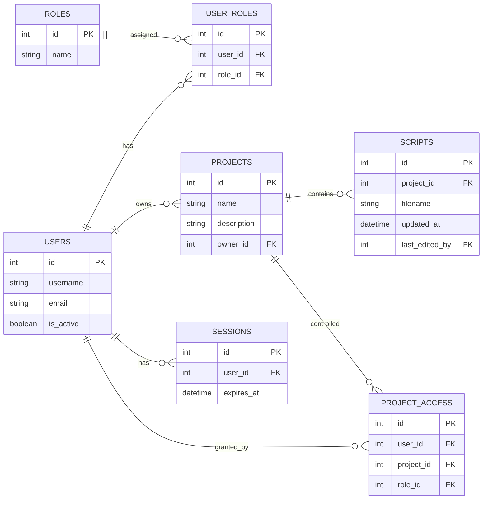

# Frontend Visual Guidelines — Аскер К

> **Strictly follow every rule in this document.** Any deviation must be approved by the team lead before committing code.

---
## 1. Purpose
Define a clear, enforceable visual contract for the Аsker К frontend so developers implement UI, layout, and animations consistently and without guesswork.

---
## 2. Technology Stack (Use Exactly These)
1. **React 18.2.0** — Core UI library for component-driven rendering. Docs: https://react.dev/  
2. **Material UI v5.12.x** — Accessible, themeable React components following Material Design. Docs: https://mui.com/  
3. **TypeScript 5.1 (strict mode)** — Static typing, interfaces, and linting. Docs: https://www.typescriptlang.org/docs/  
4. **Vite 4.x** — Fast build and development server. Docs: https://vitejs.dev/  
5. **Tailwind CSS 3.x** — Utility-first CSS framework for rapid, consistent styling. Docs: https://tailwindcss.com/  
6. **React Flow 11.x** — Graph visualization and interaction library. Docs: https://reactflow.dev/  
7. **CodeMirror 6** — Embeddable code editor for syntax highlighting and editing. Docs: https://codemirror.net/6/  
8. **Framer Motion 7.x** — Animations library with composable API. Docs: https://www.framer.com/motion/  
9. **WebSocket (native or library)** — Real-time collaboration transport.

---
## 3. Global Design Principles
- **Minimalistic & Modern (2025)**: Embrace whitespace, clear typography, and subtle neon gradients.  
- **Adaptive Themes**: Support light/dark via a single `Theme` file. Never hardcode colors—always reference theme variables.  
- **Responsive & Accessible**: Mobile-first layout; semantic HTML; keyboard navigation; screen-reader labels; contrast ratio ≥4.5:1.  
- **Motion with Purpose**: Animate entry/exit, hover, and focus states. Keep transitions ≤300 ms and avoid overwhelming users.

---
## 4. Color System
1. **Centralized Themes**: Declare all colors in `src/themes/light.ts` and `src/themes/dark.ts`.  
2. **Usage**: Use `theme.palette.primary.main`, `theme.palette.secondary.light`, etc.  
3. **Switching**: Implement live toggle; persist preference in local storage.

---
## 5. Component Style
- **Material UI**: Use MUI components and customize via `styled()`, `sx`, or theme overrides.  
- **Tailwind Utilities**: For layout and minor tweaks, supplement MUI with Tailwind classes.  
- **CSS Modules**: Only for non-MUI legacy styles; namespaced and imported per component.

---
## 6. TODO‑Driven Development
Always mark incomplete code with:
```tsx
// TODO: <short description of next task> — why it's needed.
```
These comments must reference an issue or user story number.

---
## 7. Pages

### 7.1 Home (`/`)
1. **Purpose & Redirection**: After login, route to `/`. Show dashboard reflecting the ER model (§10).  
2. **Top Bar (fixed)**: Left: Home button (MUI `<IconButton>` with `HomeIcon`). Center: App title. Right: Theme toggle, user avatar menu (`Settings`, `Logout`).  
3. **Sidebar (collapsible)**:
   - **Active Users** list: Avatars + online status indicator.  
   - **Projects** list: MUI `<List>` of cards, each showing `name` and truncated `description` from **Projects** table.  
   - **“New Project”** FAB at bottom.
4. **Main Content**:
   - Grid of **Project Cards**: Title, description, owner, last edited date. On hover: elevate and show quick actions (`Open`, `Share`).
5. **Mobile**: Collapse sidebar into bottom navigation with icons: Home, Projects, Users, Profile.

### 7.2 Editor (`/editor`)
1. **Full‑screen Canvas**: React Flow component occupies 100% width/height minus top bar.  
2. **Top Bar**: Same as Home.  
3. **Left Toolbar**: Vertical MUI `<Drawer>` with buttons: Add Node, Zoom In/Out, Pan Mode, Toggle Minimap.
4. **Tabs**: Under top bar – one tab per `LabelBlock` (from **Scripts** table).  
5. **Node Styling**: Colors from theme based on type: `LabelBlock`=yellow, `Action`=gray, `IfBlock`=green, `MenuBlock`=burgundy, `MenuOption`=orange, `End`=gray.  
6. **Interactions**:
   - Click node: open CodeMirror popup slice editor.  
   - Drag node: move subtree.  
7. **Minimap & Pan/Zoom**: Always-visible minimap; smooth zoom (wheel) and pan (drag behind canvas).

---
## 8. Visual Editor Details
- **Node Slice Editor**: Popup with CodeMirror; buttons: `Save`, `Discard`, `Switch to Full Editor`. Warn if unsaved changes.  
- **Full Editor**: Redirect to global CodeMirror view; show overlay warning; notify backend via `/notifyEditingGlobal`; rebuild tree on save.  
- **Parser Hooks**: On save, detect new blocks (`label`, `if`, `menu`) and rebuild React Flow tree.

---
## 9. Collaboration & Real‑Time
1. **WebSocket Protocol**: JSON messages: `join`, `leave`, `startEditing`, `updateNode`, `endEditing`, `insertNode`, `updateStructure`.  
2. **Locking**: On `startEditing`, lock node; release on `endEditing` or timeout.  
3. **Conflict Handling**: First‑come wins; notify user on lock attempt; auto‑merge simple non‑overlapping edits; maintain version history.
4. **Presence Indicators**: Active user list; node border highlight when locked; avatars on edited nodes; toast notifications for major events.

---
## 10. Database Schema (ER Diagram)

All UI must render this schema meaningfully on Home.

